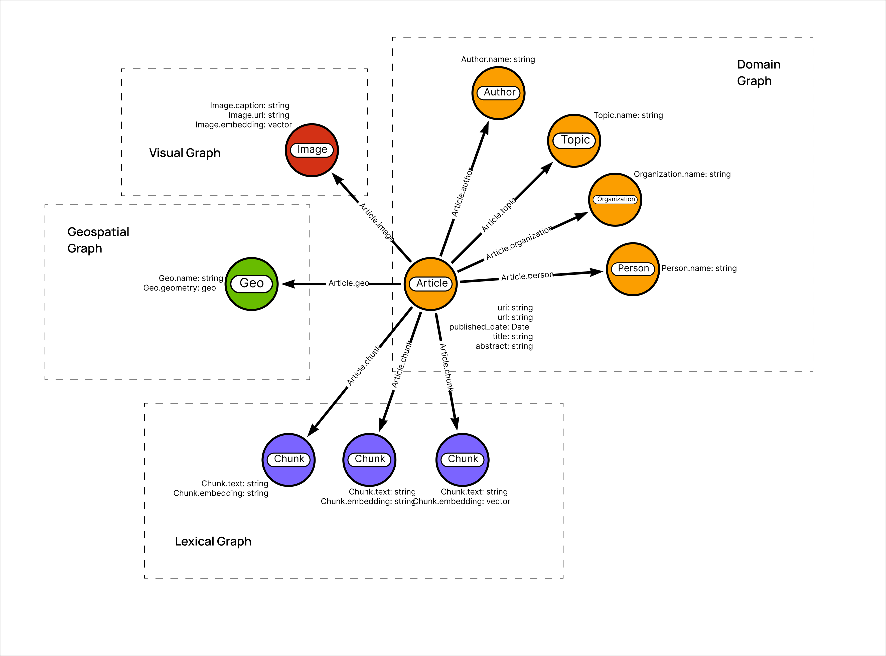
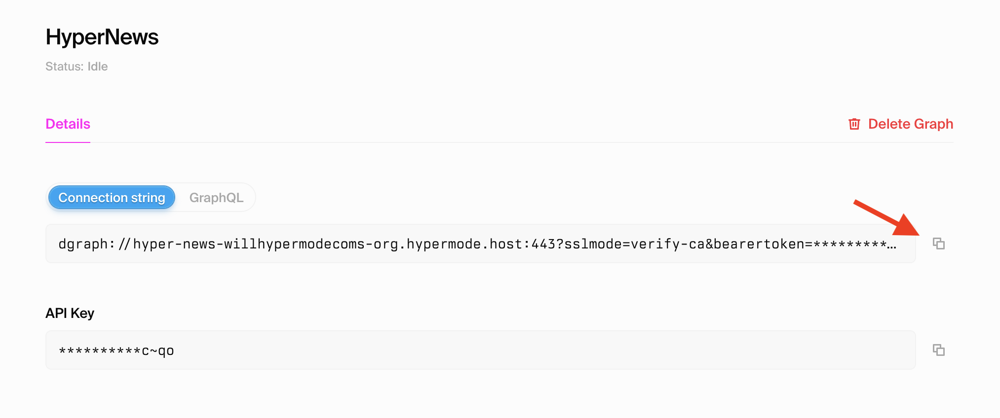
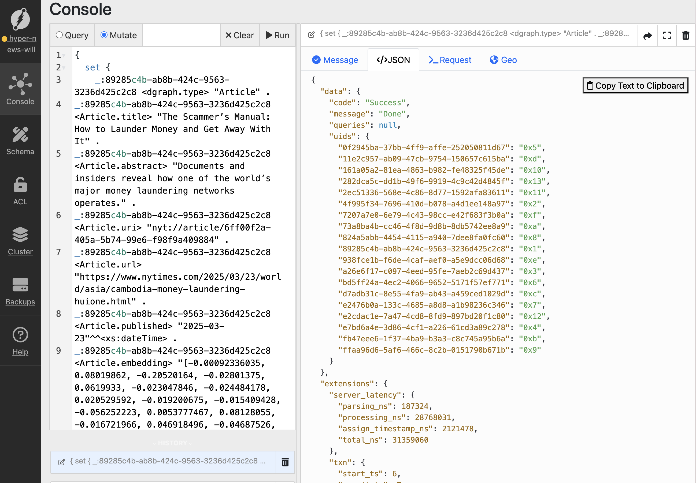
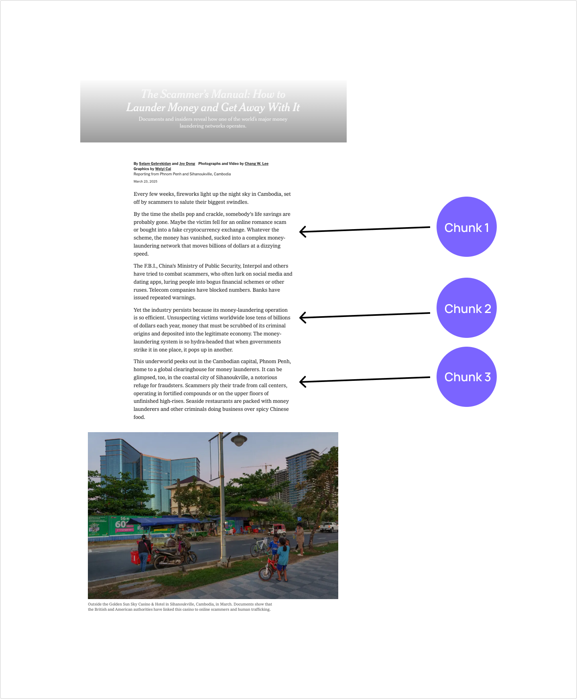

# HyperNews

Knowledge graph + AI Agent analysis of news using multi modal GraphRAG approach with Dgraph and Modus.



* Multi-modal GraphRAG approach
* Dgraph knowledge graph
* Modus for embeddings and vector similarity search
* Frontend using Next.js for chat interface and graph / map visualization

## Create Your Hypermode Graph

1. Navigate to [Hypermode](https://hypermode.com) and sign up for a free account
2. Create a new graph


3. Copy the `dgraph://` connection string, you'll use this to connect to your Hypermode Graph instance



4. Navigate to ratel.hypermode.com and connect to your Hypermode Graph instance using the `dgraph://` connection string


5. Import the sample data into your graph

Load RDF data into your graph, navigate to the [Ratel](https://ratel.hypermode.com) interface and connect to your graph using the Dgraph connection string. Then run the following mutation in Ratel (be sure to select the Mutate tab):

<details>

<summary>Copy this DQL mutation to load sample data</summary>

```dql
{
  set {
    _:89285c4b-ab8b-424c-9563-3236d425c2c8 <dgraph.type> "Article" .
_:89285c4b-ab8b-424c-9563-3236d425c2c8 <Article.title> "The Scammer’s Manual: How to Launder Money and Get Away With It" .
_:89285c4b-ab8b-424c-9563-3236d425c2c8 <Article.abstract> "Documents and insiders reveal how one of the world’s major money laundering networks operates." .
_:89285c4b-ab8b-424c-9563-3236d425c2c8 <Article.uri> "nyt://article/6ff00f2a-405a-5b74-99e6-f98f9a409884" .
_:89285c4b-ab8b-424c-9563-3236d425c2c8 <Article.url> "https://www.nytimes.com/2025/03/23/world/asia/cambodia-money-laundering-huione.html" .
_:89285c4b-ab8b-424c-9563-3236d425c2c8 <Article.published> "2025-03-23"^^<xs:dateTime> .
_:89285c4b-ab8b-424c-9563-3236d425c2c8 <Article.embedding> "[-0.00092336035, 0.08019862, -0.20520164, -0.02801375, 0.0619933, -0.023047846, -0.024484178, 0.020529592, -0.019200675, -0.015409428, -0.056252223, 0.0053777467, 0.08128055, -0.016721966, 0.046918496, -0.04687526, -0.04218578, -0.028148863, -0.042824, 0.020917423, -0.054316618, -0.032370504, -0.028675629, 0.03997199, 0.08500988, 0.017144531, -0.024979042, -0.067222975, 0.004198151, -0.06910834, 0.02121037, -0.078714, -0.053253673, -0.021370014, -0.07213128, -0.02874543, 0.055938214, 0.034668747, -0.02257444, 0.015734173, 0.002615116, 0.037297964, -0.067191556, -0.07372232, 0.0028610034, -0.007968908, 0.0040147076, -0.01675361, 0.04276194, -0.07062117, -0.013656893, 0.069650106, 0.028920174, 0.044660687, 0.031548288, -0.037835848, -0.0064255716, 0.028911343, 0.0009169275, -0.075062, 0.087536186, 0.036825977, -0.007732731, 0.042635478, 0.024788087, -0.038203984, -0.023310525, 0.021034213, 0.00862608, -0.028094534, 0.038340803, -0.007804469, 0.019761235, -0.00019656407, 0.009244875, -0.0032964468, -0.008558698, 0.0132178115, 0.008608392, 0.064217165, 0.046111107, 0.041003242, 0.04581497, 0.020273658, 0.031235896, 0.037693854, -0.013772649, -0.057372384, -0.029200299, 0.053801484, 0.05163047, 0.0047667134, 0.037192836, 0.00623493, -0.02796813, 0.007358853, -0.035745107, 0.01275867, -0.068552606, 0.018099979, -0.020371858, -0.0604366, 0.02112771, 0.021530883, 0.0660968, 0.04888558, 0.009426717, -0.010862091, -0.002711214, 0.013900116, -0.0012326023, 0.020527879, -0.014266488, 0.03844581, 0.008625611, -0.01873364, 0.066690415, 0.0015498915, 0.009729749, 0.058517713, -0.017636323, -0.053251754, -0.023646954, 0.035909656, 0.069451794, 0.016912527, -0.02761872, 0.0029756494, 0.014486133, -0.012998973, 0.02205689, 0.0031078763, -0.010682541, -0.028948735, 0.04719423, 0.077531666, -0.03247138, -0.020979341, -0.031888198, 0.041427974, 0.030766841, 0.002485652, -0.011419673, -0.00673966, -0.023038143, -0.05797337, 0.04556867, 0.0015720715, -0.031727538, -0.018073529, -0.016680855, 0.037625983, -0.04260436, -0.010235528, -0.015568282, -0.030205876, 0.012808569, -0.03778036, 0.042217124, 0.058812555, 0.025896199, -0.017201565, -0.021295544, 0.049216032, -0.035258055, -0.03243178, 0.014102597, 0.0703021, 0.020382358, 0.024729572, -0.021165065, -0.01659005, -0.064313434, 0.010731041, 0.035184678, 0.0056777354, 0.020912189, -0.02150295, 0.07346336, -0.035706487, 0.023945468, -0.026387697, 0.03752386, 0.011889463, 0.0053924406, 0.009470379, 0.0002595008, -0.058607556, 0.032467753, -0.0790825, -0.025970004, 0.031038005, -0.014906579, -0.018815886, -0.009827676, -0.0027572436, 0.013217778, 0.005055923, 0.06915567, -0.06889581, -0.041622456, -0.015985116, -0.041358333, 0.023209602, 0.016503107, 0.026923068, -0.00042518275, 0.032977626, -0.0072815083, 0.04653621, 0.080644496, -0.03536173, 0.010074264, -0.0069507305, 0.0271821, 0.0039338847, -0.00079465157, 0.0052043544, -0.009887138, -0.0049203816, -0.0019415795, 0.011910781, 0.071534336, -0.0052370583, 0.02462654, -0.0096801305, -0.06351153, -0.057395328, -0.024206541, 0.012500014, -0.040890157, -0.090973295, 0.027518911, 0.049901217, -0.026148353, -0.011612191, 0.0130564375, 0.043747183, -0.015552951, 0.043537293, -0.013374157, 0.0017572222, -0.0826361, -0.045705117, -0.04189465, 0.015048251, -0.01184995, -0.04249196, -0.011480411, 0.032527987, 0.023902439, -0.028324336, 0.04576082, 0.010670752, 0.015860224, -0.049910758, -0.029140323, 0.03384373, 0.014318717, 0.017532011, 0.016961541, -0.013189144, 0.06977469, -0.030133663, -0.013400961, -0.06195383, -0.01763788, -0.00073777395, 0.014173, -0.020227041, -0.002678048, 0.03331537, -0.017337443, 0.029439004, -0.02108535, 0.0019703307, 0.0033391328, -0.032127813, -0.06741484, 0.033954434, -0.06429553, -0.0028248366, -0.007518107, -0.04252335, -0.008083261, 0.005591775, 0.042388357, 0.037710037, 0.015690051, 0.011415067, 0.045998093, 0.023077747, 0.022285031, 0.007848019, 0.02653441, -0.028178923, 0.064425625, 0.019558094, 0.006392563, -0.061338507, 0.019965772, 0.027877463, 0.031860583, 0.08822621, 0.0021118685, -0.013568788, 0.012213977, 0.011794686, 0.011746287, -0.04255532, -0.031801987, -0.009595038, 0.0044615394, -0.002963593, -0.022992183, 0.032160193, 0.036371764, 0.018271908, 0.034596313, 0.032899648, -0.008284464, 0.017361738, -0.0075536575, -0.062124927, -0.040073045, 0.010940779, -0.035344217, -0.03577145, -0.044543967, -0.028875787, -0.0077759298, -0.0059001166, 0.026630562, -0.056429848, -0.018643763, 0.045417435, 0.015638778, 0.05498249, -0.015287093, 0.032274425, 0.059427407, -0.007727988, -0.041915257, -0.06761483, -0.015008637, -0.011633817, -0.04473641, 0.010761395, 0.04737682, 0.020224057, -0.039018407, -0.023809792, -0.0315297, -0.045886453, 0.027362607, -0.06854348, 0.02782585, 0.041447368, 0.03809086, -0.032552384, 0.058733862, -0.014951105, 0.03515661, -0.028550006, 0.004903542, 0.047009293, 0.08951287, -0.05251088, 0.0056321933, 0.02853476, -0.017408922, -0.0007259677, 0.01570457, 0.05601831, 0.00045348034, 0.033282496, -0.06320938, -0.003964976, -0.0066398317, 0.044095527, 0.02724642, -0.0070754625, -0.010164292, 0.022364479, 0.026957694, 0.011359415, -0.00507983, -0.042396206, 0.02793773, 0.013252221, -0.012907043, 0.012618729, -0.03461427, -0.0480666, 0.014978358, -0.019859375, 0.017425848, 0.03661084, 0.004448306, 0.011517026, -0.018720599, -0.035887994, -0.038497705, -0.028822478, -0.006980379, 0.05472221, -0.04450025, -0.05632212, 0.045090903, 0.004140744, 0.030121047, 0.068631604, -0.018199425, -0.04147701, 0.0013565508, 0.0387545, 0.0010663066, -0.016067801, -0.011043612, -0.014498814, 0.041405533, 0.025963515, 0.0022729675, -0.027385194, -0.045072332, 0.014473708, 0.054770585, 0.04293996, -0.04913008, -0.045752753, -0.014389631, 0.02197701, 0.02710036, -0.0025271992, -0.015185406, -0.005807928, 0.032912966, 0.0006084796, -0.0029794278, 0.08321632, 0.016833676, -0.022266852, -0.027260445, -0.042198524, 0.056657296, 0.059921164, 0.042768054, 0.0024016933, -0.061421957, 0.011560237, -0.017120233, -0.0030691596, 0.00937358, 0.037908707, 0.0679356, -0.04137055, 0.055778105, -0.027445912, -0.001642649, -0.016804658, 0.008598339, 0.028056495, -0.052670244, 0.021219566, 0.007842755, -0.028742116, 0.0019134064, -0.011207349, 0.022336535, 0.05224679, -0.045004237, 0.053058077, -0.004145731, 0.020089436, 0.013568293, -0.035345018, -0.021599242, 0.029634938, -0.0030767056, 0.0686824, 0.043787353, 0.019378748, -0.041557625, -0.033745863, 0.00733813, 0.039741762, 0.004618008, -0.024221482, -0.0023694562, -0.012751473, -0.034096964, 0.015345173, 0.02447983, -0.0373734, -0.02011196, -0.048121143, 0.008796358, -0.041615844, 0.01688993, 0.030263092, 0.064987145, 0.046141334, -0.045482814, -0.0042524887, 0.057846647, -0.030249111, 0.02020339, -0.025006311, -0.040750742, -0.021008646, -0.06500083, 0.0048085167, -0.046050336, 0.0054290835, 0.052986104, -0.05343075, 0.01965922, 0.0053141345, 0.0042541022, 0.047251824, -0.03221435, 0.016750986, -0.00782761, 0.008853598, -0.05310723, -0.0019603225, -0.008194657, -0.009547082, 0.009860242, -0.017178293, 0.0057994653, 0.043968532, -0.03219604, 0.005740256, 0.04186425, 0.0028427385, 0.015410917, 0.036574762, 0.028851394, 0.05251656, 0.044300422, -0.00097071595, -0.017772328, 0.0455604, 0.032544456, -0.04255213, 0.02168945, 0.004174097, -0.010517134, -0.05498138, 0.02181252, -0.02523621, 0.017497573, -0.024966814, 0.035447225, -0.018723119, 0.03550715, 0.03292103, -0.049964573, -0.017485676, -0.0026190714, 0.010797091, 0.07539779, -0.00016223868, -0.003050531, -0.0030678746, -0.042440422, 0.0101693515, 0.023200147, 0.023714352, -0.0064566624, -0.041058153, -0.057399467, -0.026196888, -0.0050000492, 0.009607953, 0.014601306, 0.001973055, -0.024421114, -0.0732341, 0.028464071, -0.061172992, 0.0232216, 0.019396607, 0.03719588, 0.0111135235, -0.05751737, -0.014568351, 0.012197814, -0.045055896, 0.0032212588, 0.05991664, 0.035642795, -0.04810081, 0.016432445, 0.0027162533, -0.0044268565, 0.01705664, -0.027747115, -0.06991077, -0.033055726, 0.016111575, 0.024187468, -0.06343779, 0.024146182, 0.019591013, 0.052808408, 0.030370824, -0.010137371, -0.006190875, 0.043305665, -0.0165903, -0.034973886, -0.062047835, 0.053061135, -0.027758272, 0.020876635, 0.0036199368, 0.00879301, -0.021009615, -0.029611062, -0.04211273, 0.04090435, -0.04021969, 0.028844664, -0.012987946, -0.0564927, -0.07249975, -0.0259275, 0.04196351, -0.03435903, 0.05718409, -0.030328413, -0.08229106, -0.055770762, 0.03630975, -0.034760907, 0.00054879417, 0.021047873, 0.072642975, 0.034297425, -0.04290415, 0.0116295945, 0.04317626, 0.025564436, -0.009465236, -0.007362335, 0.07016368, 0.048913628, -0.0051406906, 0.062317465, 0.0032403183, 0.014619263, -0.01384008, -0.017416125, -0.053162854, 0.043165516, -0.01638602, -0.06531059, -0.048403855, -0.021571305, 0.034827694, 0.015485262, 0.010537887, 0.037235845, -0.027256703, 0.01626456, -0.0027154225, -0.0979388, -0.0068774517, 0.002590695, -0.005167225, 0.031932924, -0.016133144, -0.029611679, 0.028033081, 0.069326274, -0.0000070652745, -0.020393176, -0.0063950093, 0.023815803, 0.07099068, 0.050766762, -0.040337384, -0.001003275, -0.0652714, -0.0052209944, -0.02312912, 0.013849191, -0.026310049, -0.023425013, -0.04465653, -0.009056439, -0.047710303, 0.0593378, 0.054269917, -0.03018837, -0.009661419, -0.078084394, 0.029557053, -0.009751387, 0.03599116, 0.014580041, 0.049669903, -0.017366845, -0.01187832, 0.031961273, 0.014016153, 0.031833317, -0.0029964242, -0.010907685, -0.03270562, -0.017315654, 0.018068928, 0.010936387, 0.007036878, -0.02308606, -0.04356114, -0.012266045, 0.009524769, 0.054658215, 0.020560471, -0.06412476, -0.04694482, -0.014909701, 0.024904164, 0.05259251, -0.012254937, -0.0048896796, -0.0072809425, -0.015564722, -0.0017214327, -0.02432279, -0.005291404, -0.0055601713, 0.008851829, -0.049824335, -0.034753803, -0.033773642, -0.05969345, -0.05878465, 0.021867614, -0.02654156, -0.030088758, -0.004052159, -0.0037078303, 0.018328678, 0.017710697, -0.0069703492, -0.025681809, 0.059779778, 0.007263781, 0.030907065, 0.022000073, 0.010014955, 0.02152092, -0.023167983, 0.035864413, 0.12227517, 0.03313528, 0.027485542, -0.016374348, 0.00008891975, 0.023746016, -0.022095548, -0.0589547, 0.0007231653, 0.00043499618 ]" .
_:bd5ff24a-4ec2-4066-9652-5171f57ef771 <dgraph.type> "Author" .
_:bd5ff24a-4ec2-4066-9652-5171f57ef771 <Author.name> "Selam Gebrekidan" .
_:bd5ff24a-4ec2-4066-9652-5171f57ef771 <Author.article> _:89285c4b-ab8b-424c-9563-3236d425c2c8 .
_:e2476b0a-133c-4685-a8d8-a1b98236c346 <dgraph.type> "Author" .
_:e2476b0a-133c-4685-a8d8-a1b98236c346 <Author.name> "Joy Dong" .
_:e2476b0a-133c-4685-a8d8-a1b98236c346 <Author.article> _:89285c4b-ab8b-424c-9563-3236d425c2c8 .
_:824a5abb-4454-4115-a940-7dee8fa0fc60 <dgraph.type> "Author" .
_:824a5abb-4454-4115-a940-7dee8fa0fc60 <Author.name> "Chang W. Lee" .
_:824a5abb-4454-4115-a940-7dee8fa0fc60 <Author.article> _:89285c4b-ab8b-424c-9563-3236d425c2c8 .
_:e2cdac1e-7a47-4cd8-8fd9-897bd20f1c80 <dgraph.type> "Author" .
_:e2cdac1e-7a47-4cd8-8fd9-897bd20f1c80 <Author.name> "Weiyi Cai" .
_:e2cdac1e-7a47-4cd8-8fd9-897bd20f1c80 <Author.article> _:89285c4b-ab8b-424c-9563-3236d425c2c8 .
_:11e2c957-ab09-47cb-9754-150657c615ba <dgraph.type> "Topic" .
_:11e2c957-ab09-47cb-9754-150657c615ba <Topic.name> "Frauds and Swindling" .
_:89285c4b-ab8b-424c-9563-3236d425c2c8 <Article.topic> _:11e2c957-ab09-47cb-9754-150657c615ba .
_:ffaa96d6-5af6-466c-8c2b-0151790b671b <dgraph.type> "Topic" .
_:ffaa96d6-5af6-466c-8c2b-0151790b671b <Topic.name> "Money Laundering" .
_:89285c4b-ab8b-424c-9563-3236d425c2c8 <Article.topic> _:ffaa96d6-5af6-466c-8c2b-0151790b671b .
_:938fce1b-f6de-4caf-aef0-a5e9dcc06d68 <dgraph.type> "Topic" .
_:938fce1b-f6de-4caf-aef0-a5e9dcc06d68 <Topic.name> "Banking and Financial Institutions" .
_:89285c4b-ab8b-424c-9563-3236d425c2c8 <Article.topic> _:938fce1b-f6de-4caf-aef0-a5e9dcc06d68 .
_:73a8ba4b-cc46-4f8d-9d8b-8db5742ee8a9 <dgraph.type> "Topic" .
_:73a8ba4b-cc46-4f8d-9d8b-8db5742ee8a9 <Topic.name> "Robberies and Thefts" .
_:89285c4b-ab8b-424c-9563-3236d425c2c8 <Article.topic> _:73a8ba4b-cc46-4f8d-9d8b-8db5742ee8a9 .
_:fb47eee6-1f37-4ba9-b3a3-c8c745a95b6a <dgraph.type> "Topic" .
_:fb47eee6-1f37-4ba9-b3a3-c8c745a95b6a <Topic.name> "Virtual Currency" .
_:89285c4b-ab8b-424c-9563-3236d425c2c8 <Article.topic> _:fb47eee6-1f37-4ba9-b3a3-c8c745a95b6a .
_:7207a7e0-6e79-4c43-98cc-e42f683f3b0a <dgraph.type> "Topic" .
_:7207a7e0-6e79-4c43-98cc-e42f683f3b0a <Topic.name> "Computers and the Internet" .
_:89285c4b-ab8b-424c-9563-3236d425c2c8 <Article.topic> _:7207a7e0-6e79-4c43-98cc-e42f683f3b0a .
_:4f995f34-7696-410d-b078-a4d1ee148a97 <dgraph.type> "Topic" .
_:4f995f34-7696-410d-b078-a4d1ee148a97 <Topic.name> "audio-neutral-immersive" .
_:89285c4b-ab8b-424c-9563-3236d425c2c8 <Article.topic> _:4f995f34-7696-410d-b078-a4d1ee148a97 .
_:d7adb31c-8e55-4fa9-ab43-a459ced1029d <dgraph.type> "Topic" .
_:d7adb31c-8e55-4fa9-ab43-a459ced1029d <Topic.name> "audio-neutral-suspenseful" .
_:89285c4b-ab8b-424c-9563-3236d425c2c8 <Article.topic> _:d7adb31c-8e55-4fa9-ab43-a459ced1029d .
_:a26e6f17-c097-4eed-95fe-7aeb2c69d437 <dgraph.type> "Organization" .
_:a26e6f17-c097-4eed-95fe-7aeb2c69d437 <Organization.name> "Huione Group" .
_:89285c4b-ab8b-424c-9563-3236d425c2c8 <Article.org> _:a26e6f17-c097-4eed-95fe-7aeb2c69d437 .
_:0f2945ba-37bb-4ff9-affe-252050811d67 <dgraph.type> "Organization" .
_:0f2945ba-37bb-4ff9-affe-252050811d67 <Organization.name> "Tether Operations Ltd" .
_:89285c4b-ab8b-424c-9563-3236d425c2c8 <Article.org> _:0f2945ba-37bb-4ff9-affe-252050811d67 .
_:161a05a2-81ea-4863-b982-fe48325f45de <dgraph.type> "Organization" .
_:161a05a2-81ea-4863-b982-fe48325f45de <Organization.name> "Telegram LLC" .
_:89285c4b-ab8b-424c-9563-3236d425c2c8 <Article.org> _:161a05a2-81ea-4863-b982-fe48325f45de .
_:282dca5c-dd1b-49f6-9919-4c9c42d4845f <dgraph.type> "Geo" .
_:282dca5c-dd1b-49f6-9919-4c9c42d4845f <Geo.name> "Phnom Penh (Cambodia)" .
_:282dca5c-dd1b-49f6-9919-4c9c42d4845f <Geo.location> "{'type':'Point','coordinates':[104.9282,11.5564]}"^^<geo:geojson> .
_:89285c4b-ab8b-424c-9563-3236d425c2c8 <Article.geo> _:282dca5c-dd1b-49f6-9919-4c9c42d4845f .
_:e7bd6a4e-3d86-4cf1-a226-61cd3a89c278 <dgraph.type> "Geo" .
_:e7bd6a4e-3d86-4cf1-a226-61cd3a89c278 <Geo.name> "Cambodia" .
_:e7bd6a4e-3d86-4cf1-a226-61cd3a89c278 <Geo.location> "{'type':'Point','coordinates':[104.9910,12.5657]}"^^<geo:geojson> .
_:89285c4b-ab8b-424c-9563-3236d425c2c8 <Article.geo> _:e7bd6a4e-3d86-4cf1-a226-61cd3a89c278 .
_:2ec51336-568e-4c86-8d77-1592afa83611 <dgraph.type> "Image" .
_:2ec51336-568e-4c86-8d77-1592afa83611 <Image.caption> "Huione is a constellation of affiliates. The headquarters of one of its companies, Huione Pay, is in Phnom Penh, Cambodia." .
_:2ec51336-568e-4c86-8d77-1592afa83611 <Image.url> "https://static01.nyt.com/images/2025/03/10/multimedia/00int-moneylaundering-03-hpgl/00int-moneylaundering-03-hpgl-thumbStandard.jpg" .
_:2ec51336-568e-4c86-8d77-1592afa83611 <Image.article> _:89285c4b-ab8b-424c-9563-3236d425c2c8 .
  }
}
```
</details>




Or using curl to upload the `data/articles/nyt_example_article.rdf` file:

```bash
curl -X POST https://<YOUR_DGRAPH_URI>/dgraph/commit \
    --header "Authorization: Bearer {{TOKEN}}" \
    --header "Content-Type: application/rdf" \
    --data @data/articles/nyt_example_article.rdf
```


## Data

This project uses data from the [New York Times developer API.](https://developer.nytimes.com/docs/most-popular-product/1/overview) Sample data is provided in the `data/articles/nyt_example_article.rdf` file.

To Register for a free NYTimes developer account, create an API key, then fetch article data:

```bash
wget --directory-prefix=data/articles/nyt/article_versions -O data/articles/nyt/article_versions/data.json https://api.nytimes.com/svc/mostpopular/v2/viewed/1.json?api-key=yourkey
```

Then use the included Python script to convert article JSON data to RDF N-Quad format to import into Dgraph

First create a venv in the root of the project:

```bash
python3 -m venv venv
```

Then you can enter the venv and install the requirements:

Enter venv:

```bash
source venv/bin/activate
```

Then run the script to convert the JSON data to RDF:

```bash
cd ./data/articles && python3 article_json_to_rdf.py
```

This will output `nyt_articles_versions.rdf` in the `data/articles/` directory.

## Local Dgraph (Optional)

Launch a local Dgraph cluster using Docker or create a free hosted [Hypermode Graph.](https://hypermode.com)

```bash
cd dgraph
docker-compose up
```

Then to open a shell in the Dgraph Alpha container:

```bash
docker exec -it news_graph_alpha /bin/bash
```

To load the RDF generated in the previous step:

```bash
dgraph live -f /data/articles/nyt_articles_versions.rdf --zero zero:5080
```

Open [ratel.hypermode.com](https://ratel.hypermode.com), connect to `http://localhost:8080` then query your graph:

```dql
{
  articles(func:type(Article),first:100) {
	Article.title
    Article.uri
    Article.url
    Article.published
    Article.abstract
    Article.topic {
      Topic.name
    }
    Article.org {
      Organization.name
    }
    Article.geo {
      Geo.name
    }
  }
}
```


### Update Dgraph schema

```bash
curl -X POST localhost:8080/alter --data-binary '@schema.dql'
```

## Modus

Update the modus `.env` file with your Dgraph connection string. See `modus/.env.example` for an example.

Install Modus CLI

```bash
npm i -g @hypermode/modus-cli
```

```bash
modus dev
```

### Embeddings



## Vector Similarity Search

```dql
 query vector_search($embedding: string, $limit: int) {
          articles(func: similar_to(Article.embedding, $limit, $embedding)) {
            uid
            Article.title
            Article.abstract
            score
          }
        }
```
